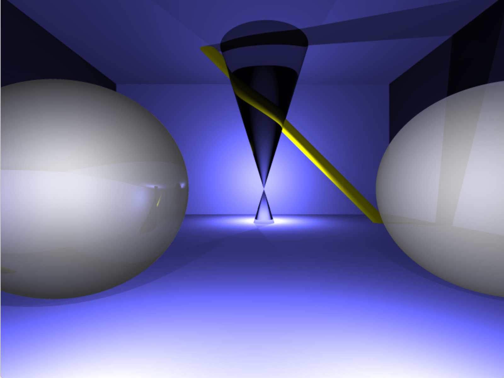
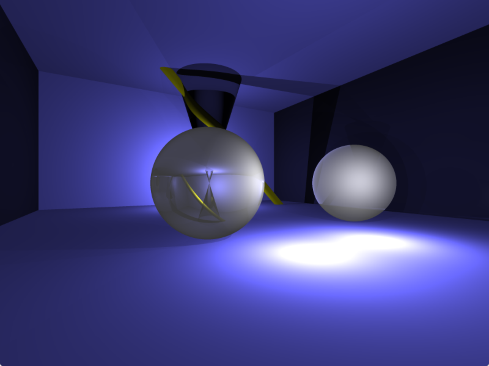
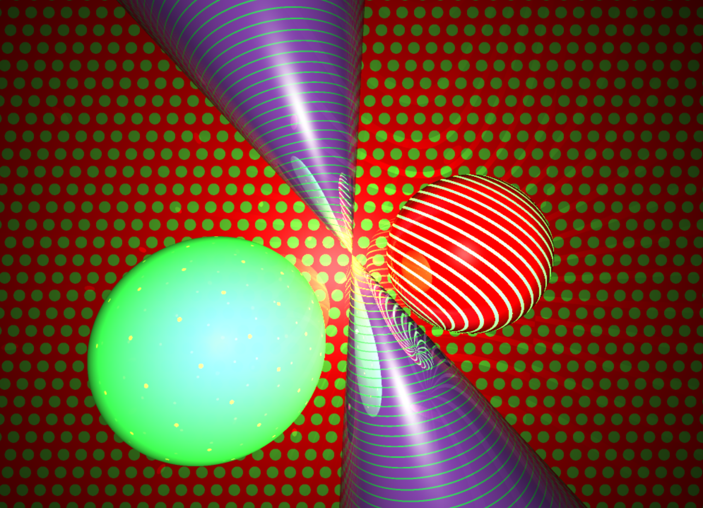
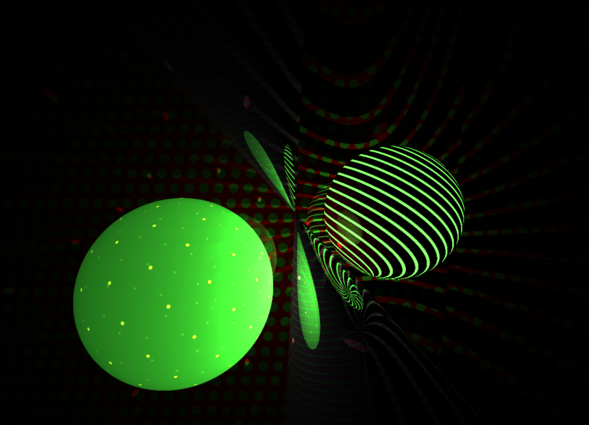
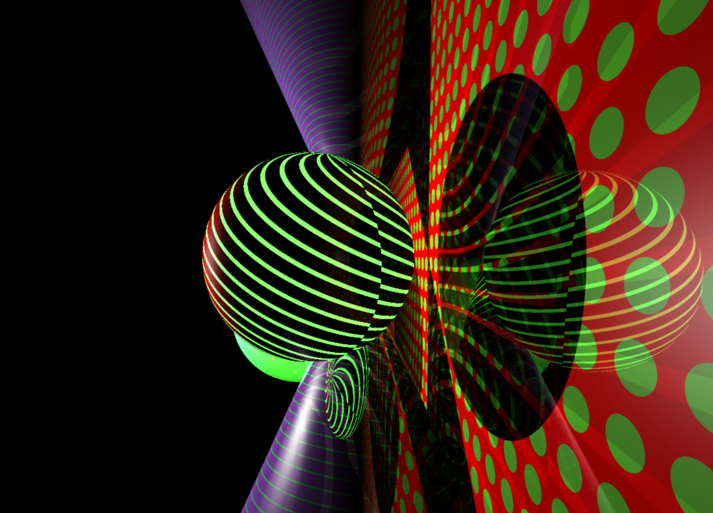
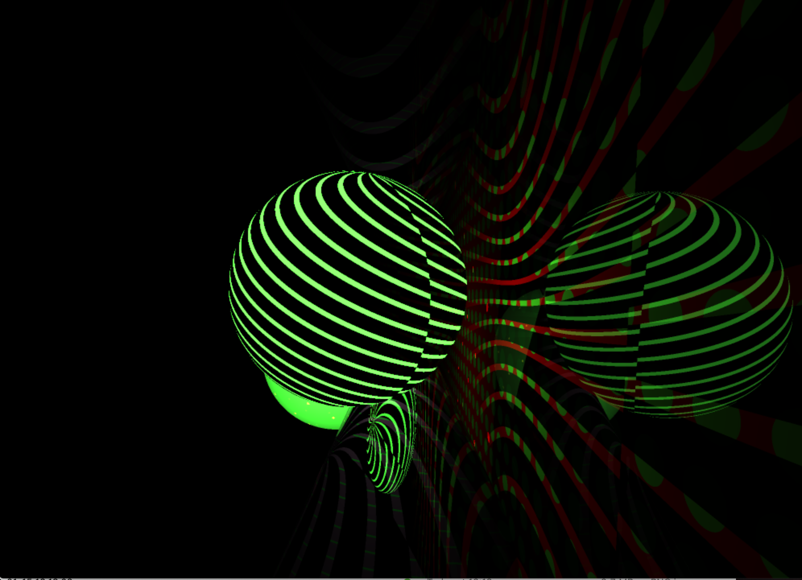
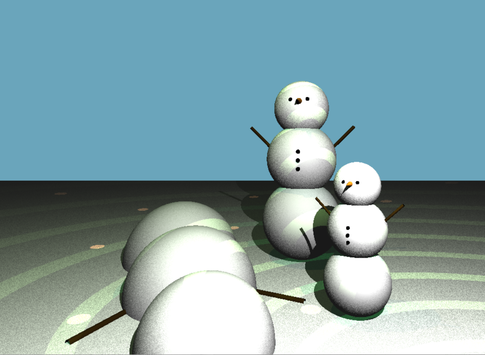
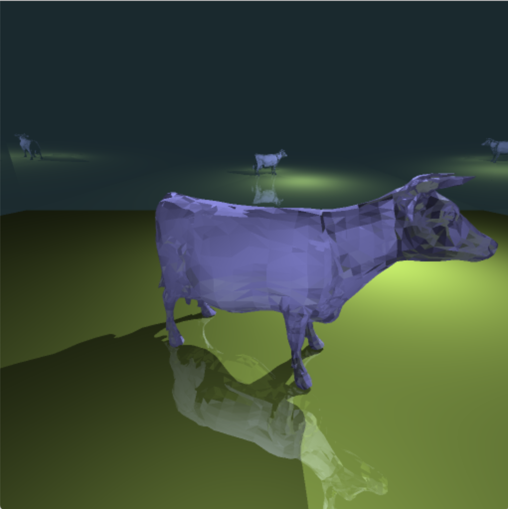

# RT - 42 project
Our goal for this project is to render images using the ray tracing technique. This technique can create images with a high degree of visual realism, though its high computational cost means it's not well suited for real time rendering.

The idea of ray tracing is that you trace a ray of light from a camera, through the pixels of your screen. You determine whether this ray hits an object in the scene you're rendering, and if it does you determine whether this point on that object is lit by a light source. Intuitively, this means that you're tracing the ray backward from camera to light source, calculating the path of one ray per pixel.

  

